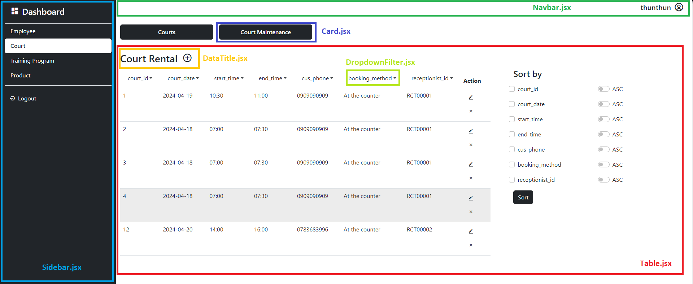
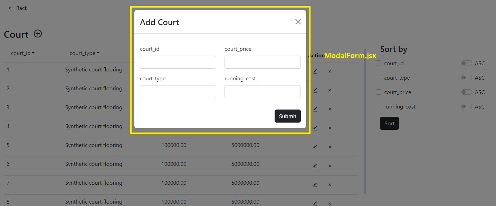

# DB_Assignment2
## 20/04/2024 update
### server

#### MySQL:
* create user 'sManager'
* GRANT privileges to 'sManager'
<br>

<br>
### Login username: sManager | password: 123456

<br>
## Setup
### Client side
In project folder, create vite-project
```
npm create vite@latest
```
> Choose React -> JavaScript


initlize client
```
cd vite-project
npm install
npm run dev
```

install neccessary libraries
```
install react-router-dom axios moment react-bootstrap react-bootstrap-time-picker
```

overwrite the files then run with
```
npm run dev
```

### Server side
In project folder, create server directory
```
mkdir server
cd server
npm init -y
```
install dependencies
```
npm install express mysql2 cors body-parser cookie-parser express-session
npm install -D nodemon
```
after that, copy all file in server.zip into folder server.

overwrite the files then run with 
```
npm start
```

REMEMBER That the terminal that run "npm run dev" is one terminal, and it has its own location
         The terminal that run "npm start" is another terminal, and it has its own location.

if you cannot login when you enter the password, please Ctrl + C the terminal of "npm start" then enter again npm start.

# Components guide


